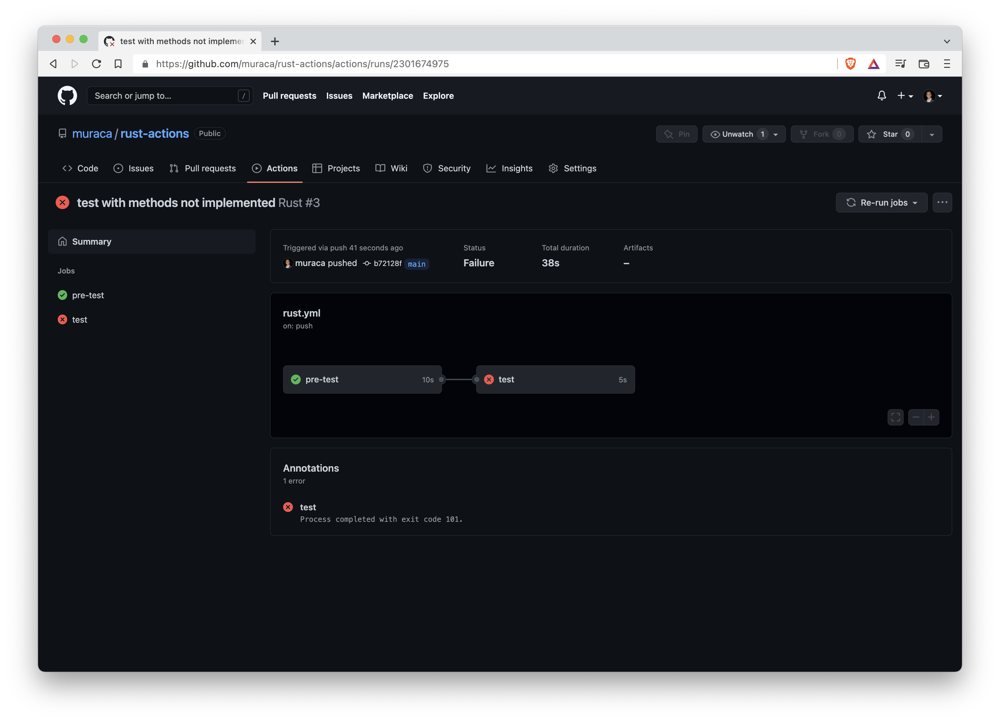

# rust-actions

This repository contains a simple library with tests, written in Rust.
The purpose of this project is to show how to perform tests in Rust, and to understand how GitHub Actions works.

---

## Tests in Rust

We have a simple library with two modules, each cointaining two methods:
```rust
mod math {
    pub fn sum_all<T>(v : &Vec<T>) -> T {
        // ...
    }

    pub fn multiply_all<T>(v : &Vec<T>) -> T {
        // ...
    }
}

mod misc {
    pub fn in_vector<T>(t : &T, v : &Vec<T>) -> bool {
        // ...
    }

    pub fn is_sorted<T>(v : &Vec<T>) -> bool {
        // ...
    }
}
```

Let's say we want to test some methods: we need to create a new module, preceeded by a specific annotation. The methods will have an annotation too.

```rust
#[cfg(test)]
mod tests {
    use super::misc;

    #[test]
    fn test_in_vector_present() {
        assert!(misc::in_vector(&1, &vec![1, 2, 3]));
    }

    #[test]
    fn test_in_vector_not_present() {
        assert_eq!(misc::in_vector(&1, &vec![2, 2]), false);
    }

    #[test]
    fn test_in_vector_empty() {
        assert_ne!(misc::in_vector(&1, &vec![]), true);
    }

    #[test]
    fn test_is_sorted() {
        assert!(misc::is_sorted(&vec![1, 2, 3, 4, 5]));
    }

    #[test]
    #[should_panic(expected = "Array is not sorted!")]
    fn test_is_not_sorted() {
        assert!(misc::is_sorted(&vec![5, 4, 6]), "Array is not sorted!");
    }

    #[test]
    #[should_panic(expected = "Vec is empty!")]
    fn test_is_sorted_empty() {
        let mut v = vec![0];
        v.pop();
        misc::is_sorted(&v);
    }
}
```

These methods will be automatically run by Cargo, using the *cargo test* command.

---

## GitHub Actions

The configuration is pretty straightforward. Various YAML files can be created in the .github/workflows/ folder, for different actions.

For example, [rust.yml](.github/workflows/rust.yml) is configured in such way:

```yml
name: Rust
```
Well, that's the name of the configuration.

```yml
on:
  push:
  pull_request:
    branches: [ main ]
```
*on* defines when the action should be triggered. For example, this particular action is triggered when some code is pushed on any branch, or when a pull request is created on main.

```yml
env:
  CARGO_TERM_COLOR: always
```
*env* defines the environment variables.

```yml
jobs:
  pre-test:
    runs-on: ubuntu-latest
    steps:
    - uses: actions/checkout@v3

    - name: Build
      run: cargo build --verbose

    - name: Style
      run: cargo fmt --check

  test:
    runs-on: ubuntu-latest
    needs: [pre-test]
    
    steps:
    - uses: actions/checkout@v3
    - name: Run tests
      run: cargo test --verbose
```
The first job, called *pre-test*, runs a build and a style check.  
The second one, called *test*, runs the test, but only if the first job is completed as expected.  
Both jobs will be run on an Ubuntu machine, but Windows and macOS can be chosen too.

There are more advanced settings, such as *defaults*, for shell and working directory, *concurrency*, and *permissions*.

When a job is running, an orange dot appears on the repository.


If we go to the Actions page, we can see the complete history for all the workflows.


For each commit, we can see the output for all the commands run on each job.  
For example, there's a failed build:


And a correct pre-test, which means that build and style have been run correctly, but the tests failed.



We can see the output and see that the methods haven't been implemented.


Let's implement the methods:


And it's looking fine on the code page too.

